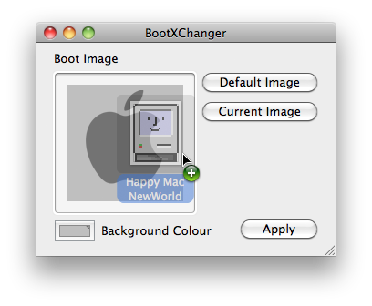

# BootXChanger

BootXChanger will allow you to change the boot image and background colour on
Mac OS X 10.4, 10.5 and 10.6 This screenshot will explain how to use it:

## System Requirements

* Intel-based Macintosh
* Mac OS X 10.4 to 10.6

## Limitations

If your image has transparency, it will be redrawn over the background colour
before being applied, so save the original somewhere in case you want to change
the background colour later.

* Some macs will scale big images down when booting, or ignore the image if it's really big.
* Some newer macs may not accept any image, and only change the background colour.
* Has not been updated since 2010

## Usage

To set an image as a boot image, open BootXChanger and drag it to the image
well, and click Apply. You can also click the background colour to change it.
You will then be asked for an administrator password, as the boot image is
stored in a system file.

## Version History

#### 2.0 - 21st May 2010

* Sets image by setting path in bootloader settings instead of altering bootloader
* Can change background colour
* Intel only

#### 1.0.4 - 10th February 2010

* Japanese localisation, courtesy of Richard Rowland
* Fixed crash that occurred on some installations of Snow Leopard
* Fixed GUI glitches in some localisations

#### 1.0.3 - 8th August 2009

* French localization, courtesy of Yann Ricquebourg
* Italian localization, courtesy of Simone Dall'Angelo
* Traditional Chinese localization, courtesy of Hung Ju Lu
* Dutch localization, courtesy of Huub Everstijn
* Swedish localization, courtesy of Henrik Engman
* Fixed bug that crashed the app on Snow Leopard

#### 1.0.2 - April 20, 2008

* Fixed problem on new penryn-based macs
* German localization, courtesy of Michael Fuchs
* Russian localization, courtesy of Arkady Vyrlan

#### 1.0.1 - February 12, 2008

* Compatibility with Mac OS X 10.5.2
* Sparkle framework for auto updating
* Hungarian localization, courtesy of András Bognár

#### 1.0 - December 14, 2007

* Initial release
